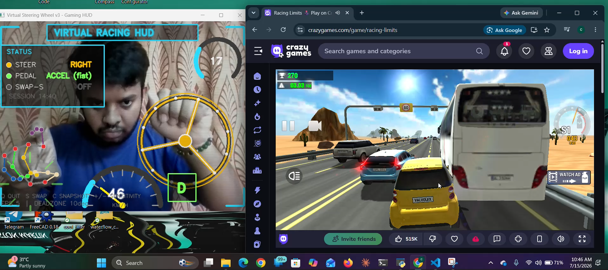

# Virtual Steering Wheel 🎮🖐️

Control racing games with your bare hands and a webcam — no hardware wheel needed. Your **right hand** becomes the steering wheel and your **left hand** becomes the accelerator/brake, tracked live with [MediaPipe Hands](https://developers.google.com/mediapipe) and translated into real keyboard input.



## Features

- **Right hand = steering.** Tilt your right hand like you're holding a wheel:
  - Flat/level hand → **CENTER** (drive straight, no keys pressed)
  - Tilt right → **RIGHT** arrow key held
  - Tilt left → **LEFT** arrow key held
  - Works correctly whether your palm or the back of your hand faces the camera.
- **Left hand = pedals.**
  - Closed fist ✊ → **UP** arrow (accelerate)
  - One finger up ☝️ → **DOWN** arrow (brake/reverse)
  - Open/relaxed hand → neutral, no keys pressed
- **On-hand steering wheel graphic** — a wheel overlay anchored to your wrist, sized to your hand, that rotates as you tilt.
- **Full-window cyberpunk racing HUD** — corner brackets, scanlines, vignette, glowing animated title, analog speedometer, gear indicator (D/N/R), and live status panels.
- **Live sensitivity tuning** — widen or narrow the steering dead zone on the fly with `+` / `-`, no code edits needed.
- **Hand swap toggle** — press `S` if steering feels mirrored for your setup.
- **Snapshot capture** — press `C` to save the current HUD frame as a PNG.
- **Session timer** and FPS counter built into the HUD.

## Demo


## Requirements

- Python 3.9+
- A webcam
- OS: Windows, macOS, or Linux (tested with a standard USB/laptop webcam)

Python packages (see [`requirements.txt`](requirements.txt)):

```
opencv-python
mediapipe
numpy
pynput
```

## Installation

1. **Clone the repository**

   ```bash
   git clone https://github.com/gourab354/virtual-steering-wheel.git
   cd virtual-steering-wheel
   ```

2. **(Recommended) Create a virtual environment**

   ```bash
   python -m venv venv
   source venv/bin/activate      # Windows: venv\Scripts\activate
   ```

3. **Install dependencies**

   ```bash
   pip install -r requirements.txt
   ```

## Usage

Run the script:

```bash
python steering_wheel_v2.py
```

A window will open showing your webcam feed with the racing HUD overlaid. Position yourself so both hands are visible to the camera, then:

1. Hold up your **right hand** and tilt it left/right like a steering wheel.
2. Make a **fist** with your **left hand** to accelerate, or hold up **one finger** to brake.
3. Focus the game/app window you want to control (arrow-key input is sent globally via `pynput`), and drive!

### Controls

| Key       | Action                              |
|-----------|--------------------------------------|
| `Q`       | Quit                                  |
| `S`       | Toggle left/right hand swap           |
| `C`       | Save a snapshot of the current HUD    |
| `+` / `=` | Increase steering dead zone (degrees) |
| `-`       | Decrease steering dead zone (degrees) |

## Configuration

Key tunables live at the top of `steering_wheel_v2.py`:

| Variable            | Description                                       | Default |
|---------------------|-----------------------------------------------------|---------|
| `CAMERA_INDEX`       | Which webcam to use                                | `0`     |
| `FLIP_CAMERA`        | Mirror the camera feed                             | `True`  |
| `DEAD_ZONE_DEG`      | Degrees of tilt ignored around center               | `10`    |
| `GRACE_FRAMES`       | Frames to wait before treating a hand as "lost"     | `8`     |
| `MIN_DET_CONF`       | MediaPipe minimum detection confidence              | `0.7`   |
| `MIN_TRACK_CONF`     | MediaPipe minimum tracking confidence               | `0.5`   |
| `STEERING_HAND`      | Which hand steers (`"Right"` / `"Left"`)            | `"Right"` |
| `GAS_BRAKE_HAND`     | Which hand controls pedals                          | `"Left"`  |
| `STEER_SMOOTHING`    | Smoothing factor for the steering angle (0–1)       | `0.4`   |
| `WHEEL_SCALE`        | Size of the on-hand wheel graphic relative to hand span | `1.8` |
| `SENSITIVITY_STEP`   | Degrees changed per `+`/`-` key press                | `2`     |

## How it works

1. **MediaPipe Hands** detects up to two hands per frame and returns 21 landmarks per hand.
2. For the steering hand, the angle between the **index knuckle** and **pinky knuckle** is measured and folded into a `-90°`–`90°` range so a flat hand always reads as `0°` (straight ahead), regardless of whether your palm or the back of your hand faces the camera.
3. That angle is compared against the dead zone to decide `LEFT` / `CENTER` / `RIGHT`, and the corresponding arrow key is simulated with `pynput`.
4. For the pedal hand, simple finger-extension checks detect a fist (accelerate) or a single raised index finger (brake), each mapped to the `UP`/`DOWN` arrow keys.
5. Everything is drawn back onto the frame as a full HUD using OpenCV.

## Troubleshooting

- **Steering feels reversed** → press `S` to swap hands, or set `SWAP_HANDS = True` in the config.
- **Wheel doesn't center properly** → increase `DEAD_ZONE_DEG` slightly, or hold your hand flatter/more level.
- **Hand not detected** → improve lighting, make sure your hand is fully in frame, or lower `MIN_DET_CONF`.
- **Low FPS** → close other camera-heavy apps, or reduce your webcam resolution.

## License

Add your preferred license here (e.g. MIT).
